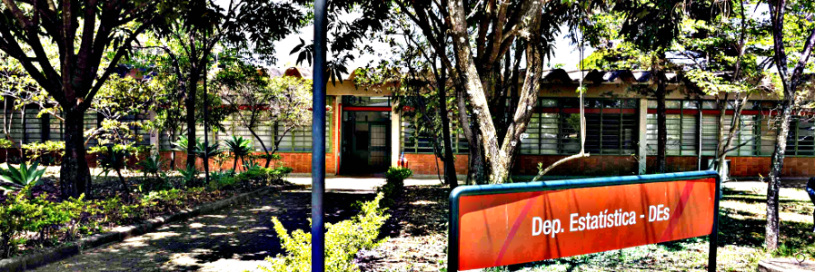

# UFSCar — Statistics & Data Science Portfolio

A collection of statistical analyses and data science exercises, primarily developed during my Statistics undergraduate studies at the Federal University of São Carlos (UFSCar), together with selected complementary coursework and workshops.

The material spans statistical modeling, inference, experimental design, time series, multivariate analysis, nonparametric statistics and applied data analysis, implemented in R, Python and SAS depending on the project.

## Projects

| Project | Main Topics |
| --- | --- |
| [Credit Risk Analysis](credit-risk-analysis/) | Logistic regression, classification, stepwise variable selection |
| [Data Mining](data-mining/) | Linear/polynomial regression, logistic regression, model selection, cross-validation, SVM |
| [Experimental Design](experimental-design/) | ANOVA, ANCOVA, factorial and nested designs, Tukey HSD |
| [Financial Time Series](financial-time-series/) | Log-returns, ARIMA, GARCH volatility, state-space models |
| [Multivariate Analysis](multivariate-analysis/) | Principal Component Analysis (PCA) |
| [Natural Language Processing](natural-language-processing/) | Text preprocessing, Bag-of-Words, TF-IDF, Naive Bayes |
| [Nonparametric Statistics](nonparametric-statistics/) | Simulation, nonparametric group comparisons, spline regression |
| [Time Series](time-series/) | Descriptive analysis, ARIMA modeling, residual diagnostics |
| [Undergraduate Thesis](undergraduate-thesis/) | Meteorological data, financial series, wavelet analysis |

## Statistical Areas

- **Modeling and inference**: linear and logistic regression, generalized linear models, hypothesis testing
- **Experimental design**: ANOVA, ANCOVA, factorial and nested designs, multiple comparisons
- **Time series**: Box-Jenkins/ARIMA modeling, GARCH volatility models, state-space models and Kalman filtering, wavelet analysis
- **Multivariate statistics**: Principal Component Analysis
- **Nonparametric statistics**: simulation studies, rank-based tests, spline regression
- **Applied data analysis**: exploratory data analysis, classification, model validation

## Tools

- **R** — experimental design, financial time series, multivariate analysis, nonparametric statistics
- **Python** — data mining, natural language processing, time series, undergraduate thesis
- **SAS** — financial time series (volatility modeling)

## Notes

- The `natural-language-processing` project was not developed as part of UFSCar coursework; it originates from an introductory NLP workshop by Visagio (see its [README](natural-language-processing/README.md) for details).
- Most notebooks were built for exploratory, academic purposes rather than production use, and are best read alongside their outputs on GitHub.
