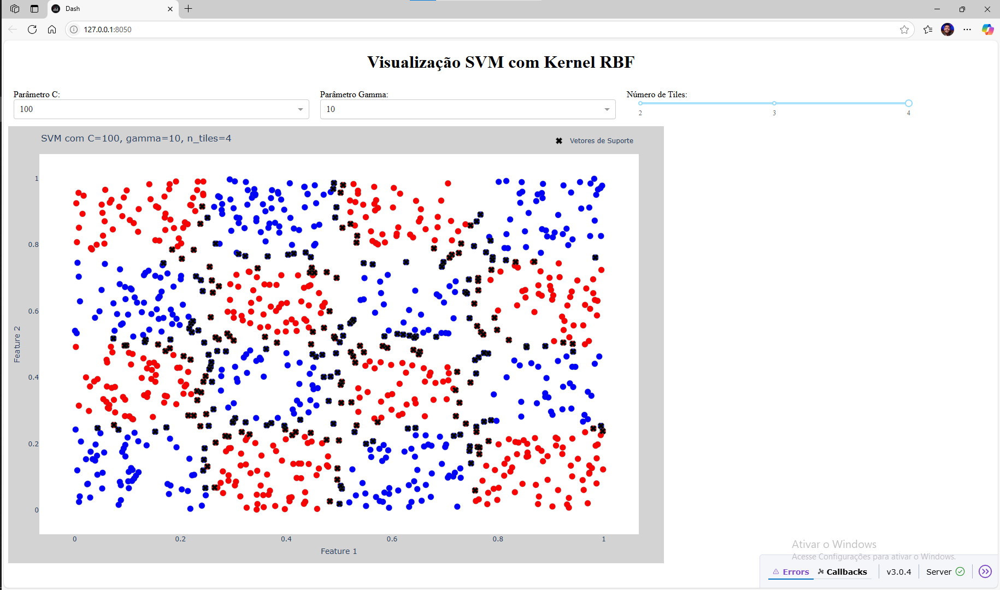

# SVM Interactive Demo

Interactive visualization of a Support Vector Machine classifier with an RBF kernel, built with [Dash](https://dash.plotly.com/) and [Plotly](https://plotly.com/python/).

The app generates a synthetic checkerboard-pattern classification dataset and lets you adjust the model's parameters to see how the decision boundary and support vectors change in real time.

## Overview

Three controls are exposed in the UI:

* **C** — penalty parameter for classification error
* **Gamma** — kernel coefficient controlling the influence of a single training point
* **n_tiles** — granularity of the checkerboard pattern used to generate the data

On every change, the app regenerates the checkerboard dataset, refits an `SVC(kernel='rbf')` model from scikit-learn, and redraws the data points, decision regions and support vectors.

## Preview



## Running locally

```bash
pip install dash plotly scikit-learn numpy
python app.py
```

Then open [http://127.0.0.1:8050](http://127.0.0.1:8050) in a browser.

## Repository Structure

```text
svm-interactive-demo/
├── app.py
├── preview.png
└── README.md
```

## Tools

**Python** — Dash, Plotly, scikit-learn, NumPy
