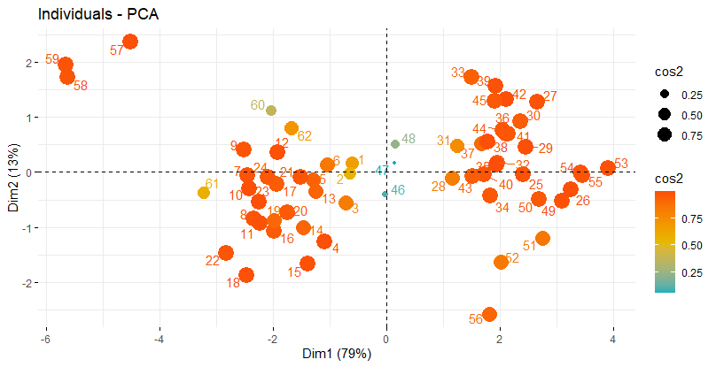

# Multivariate Analysis — PCA

Principal Component Analysis (PCA) applied to a pulp fiber properties dataset, exploring how correlated quantitative variables can be summarized into a smaller set of components.

This project focuses on PCA; it is not a broader survey of multivariate techniques.

## Overview

The dataset (`pulp-fibers.csv`) contains eight quantitative variables describing physical properties of pulp fibers (e.g. fiber length, breaking length, elasticity, stress, burst strength). The analysis examines the correlation structure between these variables and reduces their dimensionality with PCA.

## Methods

* Correlation matrix and clustered correlation heatmap
* Pairwise scatterplot matrix
* Principal Component Analysis (`FactoMineR::PCA`)
* Eigenvalues and scree plot for selecting the number of components
* Variable contributions and quality of representation (`cos2`) on the principal components
* Individual (observation) coordinates and quality of representation on the principal components

## Visualization



## Repository Structure

```text
multivariate-analysis/
├── pca-analysis.R
├── pulp-fibers.csv
├── pca-individuals.png
└── README.md
```

## Tools

**R** — `FactoMineR`, `factoextra`, `GGally`, `corrplot`, `ggplot2`

## Academic Context

This analysis was developed during Statistics coursework at UFSCar as an application of Principal Component Analysis to a multivariate dataset.
