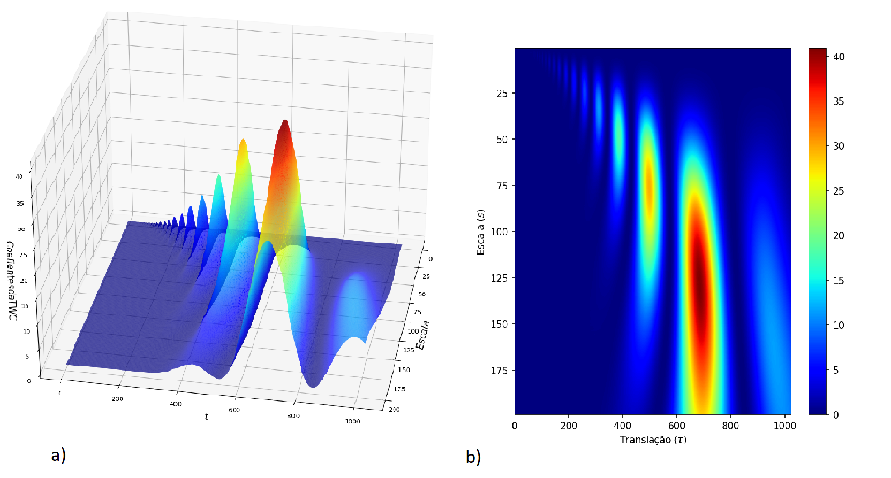

# Wavelet Multivariate Time Series Analysis

Undergraduate thesis in Statistics developed at the Federal University of São Carlos (UFSCar) and defended in 2023.

The study investigates time-varying relationships among four financial series — **IBOVESPA, Dow Jones Industrial Average, S&P 500 and Bitcoin** — using wavelet-based methods.

<p align="center">
  
</p>

<p align="center">
  <em>Continuous Wavelet Transform represented as a 3D coefficient surface and scalogram.</em>
</p>

## Research objective

The thesis explores wavelets as an alternative framework for studying non-stationary financial time series. Rather than measuring association only at a single global scale, wavelet methods allow relationships to be examined across both time and scale/frequency.

## Data

The final application uses:

| Series | Symbol used in the code |
| --- | --- |
| IBOVESPA | `^BVSP` |
| Dow Jones Industrial Average | `^DJI` |
| S&P 500 | `^GSPC` |
| Bitcoin | `BTC-USD` |

The thesis describes daily observations from January 2012 through July/August 2023, collected from Yahoo Finance through `yfinance` / `pandas_datareader`.

No INMET meteorological data are part of the final defended application.

## Methods

The final thesis applies:

- missing-data inspection and treatment;
- rolling mean and variance diagnostics;
- Augmented Dickey-Fuller stationarity tests;
- Continuous Wavelet Transform (CWT);
- wavelet scalograms and 3D coefficient visualizations;
- multiresolution analysis (MODWT/MRA);
- multiscale wavelet correlation;
- wavelet coherence.

Python was used for data collection, descriptive analysis, stationarity diagnostics and CWT visualizations. MATLAB was used for multiresolution decomposition, multiscale correlation and wavelet coherence.

## Repository structure

```text
undergraduate-thesis/
├── README.md
├── requirements.txt
├── thesis/
│   └── TCC_MKM_versao_final.pdf
├── notebooks/
│   └── financial-wavelet-analysis.ipynb
└── matlab/
    └── wavelet-analysis.m
```

## Source-code reconstruction

The original development folder contained exploratory material from earlier stages of the project, including INMET meteorological experiments. Those files were not part of the final analysis and have been removed from this repository.

The Python notebook and MATLAB script in this directory were reconstructed from the code printed in **Appendix A of the final defended thesis**. The reconstruction preserves the original analytical logic. Typographic characters introduced by the PDF/LaTeX rendering were normalized where necessary so the code can be represented as source code.

The appendix itself contains a few inconsistencies between prose, labels and code. They are documented inside the reconstructed notebook rather than silently corrected.

## Python dependencies

The thesis did not record exact package versions. The reconstructed notebook uses the packages listed in [`requirements.txt`](requirements.txt).

## Academic context

**Title:** *Análise de séries temporais multivariadas via Wavelet*  
**English title:** *Wavelet Multivariate Time Series Analysis*  
**Program:** Bachelor of Statistics, UFSCar  
**Advisor:** Prof. Dr. Maria Sílvia de Assis Moura  
**Defense:** August 24, 2023

## Notes on reproducibility

This repository is intended to document the analysis that appears in the final thesis, not every exploratory step taken during its development.

Because the original 2023 environment and exact dependency versions were not preserved, changes in Yahoo Finance access or package APIs may require minor compatibility adjustments to execute the notebook today. Any such modernization should be kept separate from the source-faithful reconstruction.
